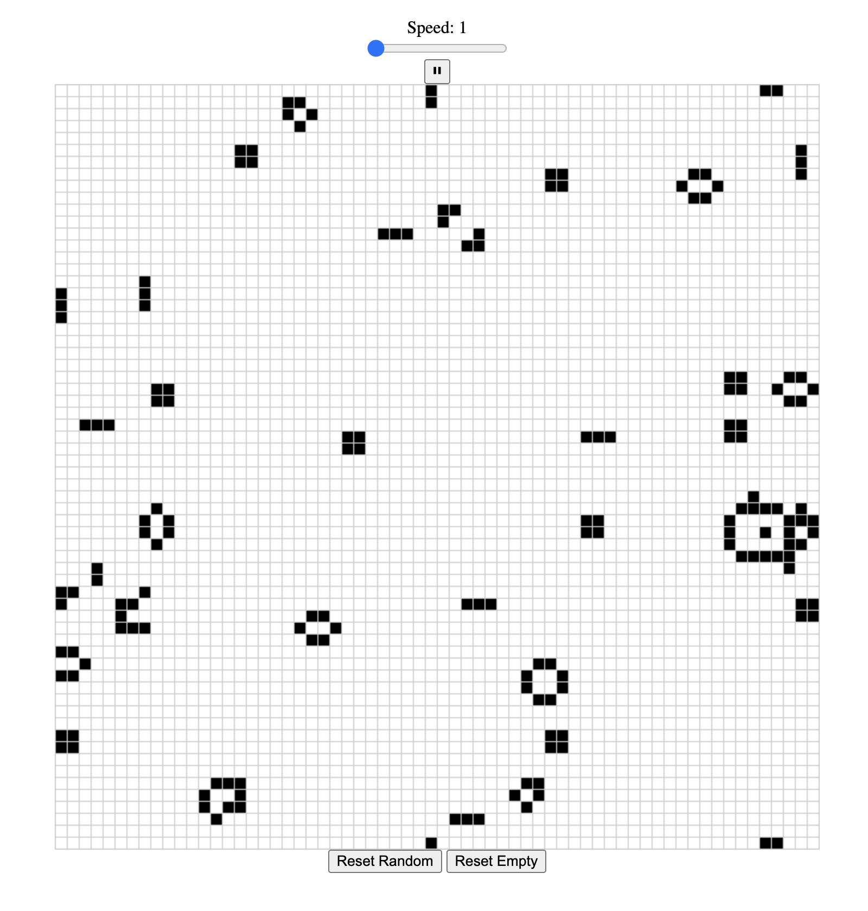

# Game of Life

This is a project that uses Rust compiled to WebAssembly to create the backend of the game, and interfaces with HTML, CSS and Javascript to provide the visual representation of John Conway's Game of Life, which is a graph of cells that can be represented in either a live or dead state, and evolve based on a cell's neighbors.

A cell becomes dead or alive based on four rules:

1. Any live cell with fewer than two live neighbours dies, as if by underpopulation.
2. Any live cell with two or three live neighbours lives on to the next generation.
3. Any live cell with more than three live neighbours dies, as if by overpopulation.
4. Any dead cell with exactly three live neighbours becomes a live cell, as if by reproduction.

## Installation

1. Clone the repository: `git clone https://github.com/PhilipTimofeyev/wasm-game-of-life.git`
2. Navigate to the project directory: `cd wasm-game-of-life`
3. Build the project: `wasm-pack build`
4. Navigate to `www`: `cd www`
5. Install the npm dependencies: `npm install`

## Usage

1. Start the development server: `npm run start`
2. Open `http://localhost:8080/` in your browser to view and play the game.
3. The 64 x 64 cell grid can be instantiated with random states or empty, allowing the user to toggle a cell's state by clicking on it.
4.  A glider can be created by shift + clicking a cell, or a pulsar by option + clicking a cell.

## License

Game of Life is licensed under the MIT license. See [LICENSE](https://opensource.org/license/mit) for more information.

